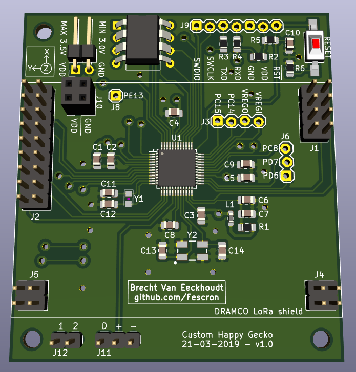
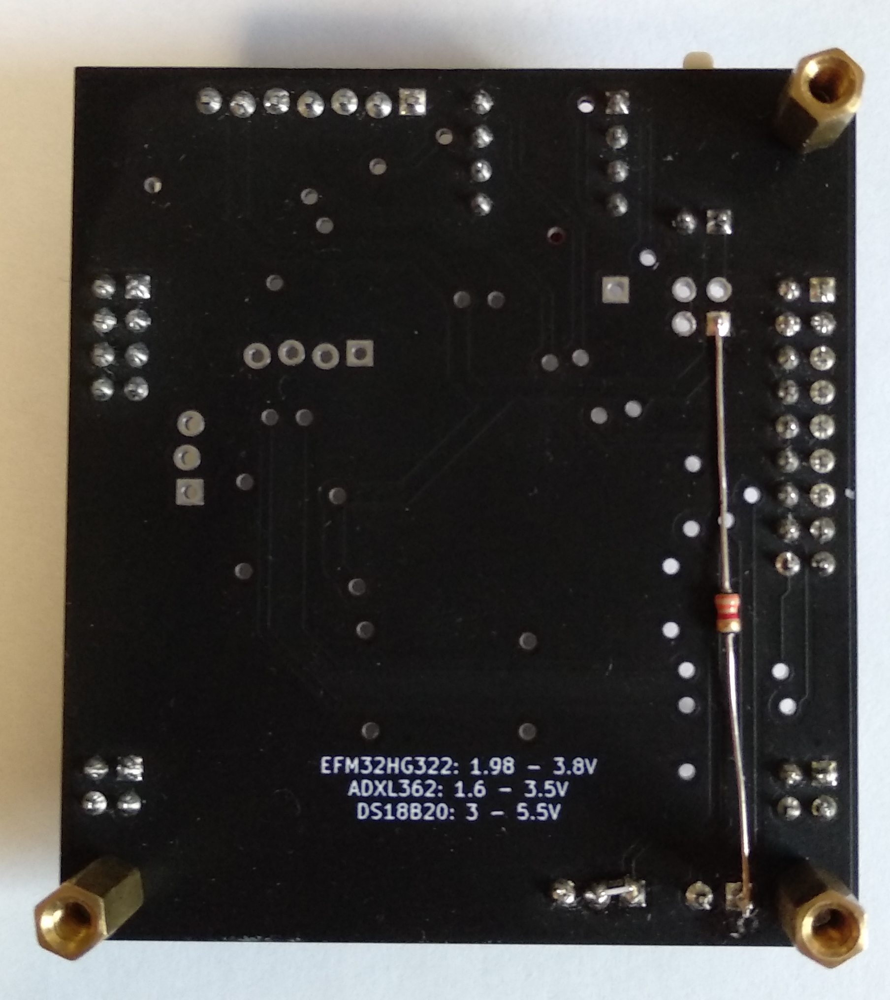
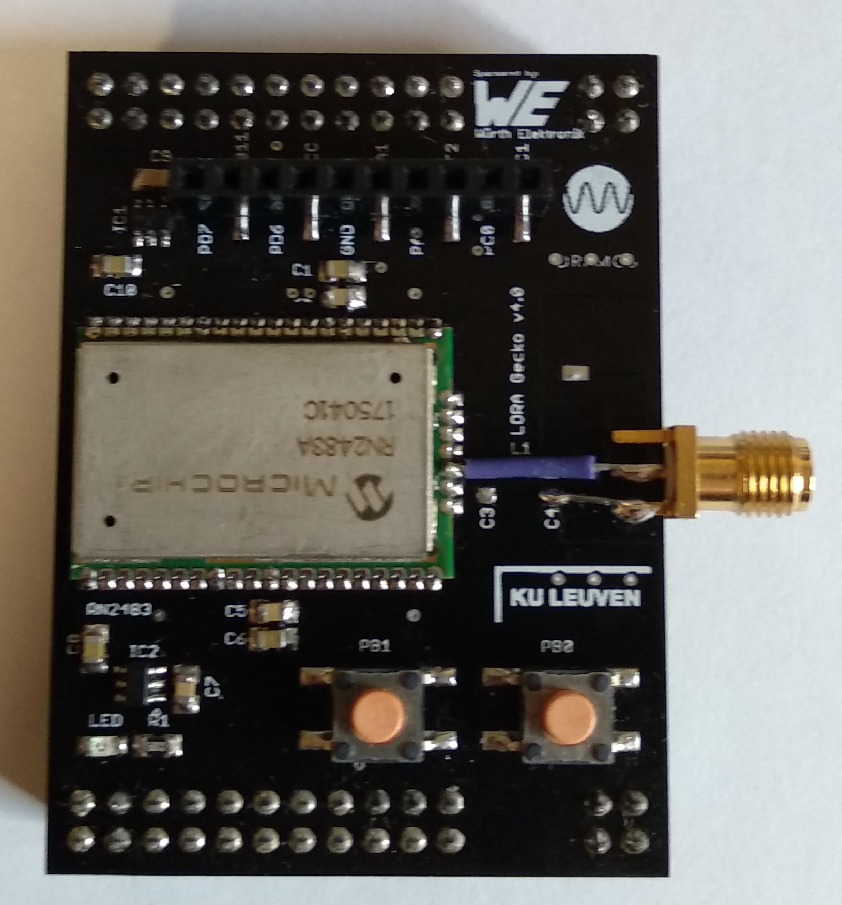

# Project-LabEmbeddedDesign2

 

This repository contains the **presentation**, **reports** and **code** for the project constructed for **Embedded System Design 2 - Lab**.

 

 

## 1 - Quick links

- [**Reports and presentation**](documentation/reports)
- [General important Doxygen documentation](https://fescron.github.io/Project-LabEmbeddedDesign2/index.html)
- [Doxygen code documentation of individual files and methods](https://fescron.github.io/Project-LabEmbeddedDesign2/files.html)
- [Code for the custom TTN decoder](software/decoder.js)
- [Schematic of custom PCB](documentation/schematics/project-embeddedSystemDesign2.pdf)
- [Schematic of DRAMCO LoRaWAN shield](documentation/schematics/dramco-LoRa-addon-schematic-v4-0.pdf)
- [Picture with PCB dimensions](hardware/project-embeddedSystemDesign2/3d-renders/project-embeddedSystemDesign2-pcb-dimensions.png)
- [The Things Network - Applications](https://console.thethingsnetwork.org/applications/)
- [Cayenne Dashboard](https://cayenne.mydevices.com/cayenne/dashboard/start)

 

## 2 - GIT repo structure

|  Location  |  Content  |
| ---------- | --------- |
| [/docs/](https://fescron.github.io/Project-LabEmbeddedDesign2/index.html) | **[Doxygen](http://www.doxygen.org) code documentation.** |
|        |           |
| [/documentation/current measurements/](documentation/current%20measurements) | Documents containing current measurements. |
| [/documentation/current measurements/measurements-SF/](documentation/current%20measurements/measurements-SF) | Pictures depicting current profiles for sending 6 measurements at full gain with different LoraWAN *Spreading Factors*. More information can be found in section *"3 - LoRaWAN spreading factor (RN2483)"* in [this](documentation/current%20measurements/currents-2-projectEmbeddedDesign2.pdf) file . |
|        |           |
| [/documentation/datasheets/](documentation/datasheets) | General datasheets regarding the used items. |
| [/documentation/datasheets/hardware-design/](documentation/datasheets/hardware-design) | Documents regarding hardware design for the `EFM32HG` microcontroller. |
| [/documentation/datasheets/timers-energy-rtc/](documentation/datasheets/timers-energy-rtc) | Documents regarding `timers`, the `RTC` and `energy modes` on the `EFM32HG` microcontroller. |
|        |           |
| [/documentation/figures/](documentation/figures) | Figures used in reports and the README. |
| [/documentation/figures/installation/](documentation/figures/installation) | **Pictures taken during the project installation.** |
| [/documentation/reports/](documentation/reports) | **Reports and presentation.** |
| [/documentation/schematics/](documentation/schematics) | Schematics.    See [this](documentation/schematics/project-embeddedSystemDesign2.pdf) file for the schematic of the *self designed PCB* and [this](documentation/schematics/dramco-LoRa-addon-schematic-v4-0.pdf) file for the schematic of the *DRAMCO LoRaWAN shield*.
|        |           |
| [/hardware/project-embeddedSystemDesign2/](hardware/project-embeddedSystemDesign2) | [KiCad](http://kicad-pcb.org/) PCB design files.   See [this](hardware/project-embeddedSystemDesign2/pdf/project-embeddedSystemDesign2.pdf) file for the *schematic* and [this](hardware/project-embeddedSystemDesign2/bom/bom-custom-gecko-v1-0.pdf) file for the *BOM*. |
| [/hardware/project-embeddedSystemDesign2/3d-renders/](hardware/project-embeddedSystemDesign2/3d-renders) | Pictures of 3D renders of the *self designed PCB*.   On [this](hardware/project-embeddedSystemDesign2/3d-renders/project-embeddedSystemDesign2-pcb-dimensions.png) picture the *dimensions* are displayed.    [This](hardware/project-embeddedSystemDesign2/3d-renders/project-embeddedSystemDesign2.png) is a render of the *front* and [this](hardware/project-embeddedSystemDesign2/3d-renders/project-embeddedSystemDesign2-back.png) is a render of the *back*. |
|        |           |
| [/software/EFM32HG-Embedded2-project/](software/EFM32HG-Embedded2-project) | **Code for the project.**   See [this](https://fescron.github.io/Project-LabEmbeddedDesign2/index.html) page for *general important documentation* and [this](https://fescron.github.io/Project-LabEmbeddedDesign2/files.html) page for information regarding *individual files and their methods*. [This](software/decoder.js) is the *decoder* for use on The *Things Network*. |

 

## 3 - Code flow

**Note:** The code is developed using `Simplicity Studio v4` on `Ubuntu 18.04 LTS`. The code also needs **dbprint** functionality, which needs to be added alongside the code on this repository for it to compile again. See [dbprint GIT repo](https://github.com/Fescron/dbprint) for more info regarding this.

**Extra notes on the flowchart:**

- **(\*1):** The following things get initialized:
    - Chip
    - GPIO wakeup (buttons & ADXL INT1)
    - ADC
    - Disable RN2483
    - Accelerometer (initialize SPI and use it to configure the accelerometer
- **(\*2):** On every external temperature measurement the VDD and DATA pin get re-configured. The oneWire protocol is achieved using *bit-banging*.
- **(\*3):** The RN2483 module gets enabled and configured before sending the data. Afterwards it gets disabled again. The **status** message is always send, measurements only if there are any recorded.
- **(\*4):** Only one set of measurements are send along with the status message.
- **(\*5):** The value of **X** depends on a configured setting.
- **(\*6):** A status message is send along with any recorded measurements.

 

- Before entering a *sleep* state **all GPIO (data) pins are disabled** so they can't consume any power.
- **Clocks and peripherals** are only enabled when necessary.
- If an **error** occures this gets **forwarded to the cloud using a LoRaWAN status message**.
- To conserve sended bytes a **custom data-format** was used (along with a *decoder*).
- Negative internal and external temperatures were successfully send and displayed. The internal temperature seems to be 2 - 3 °C off.

 

## 4 - Extra hardware changes

The [schematic](hardware/project-embeddedSystemDesign2/pdf/project-embeddedSystemDesign2.pdf) for the custom PCB **misses two resistors**. A surface mount `10 kΩ` resistor was added between the *data* and *power* pin for the DS18B20 temperature sensor. A `3,3 kΩ` resistor with wires was added between the `BREAK_1`pin and `VDD`. These added resistors can be seen on the bottom right on the left most picture below.

 

An **SMA connector for an external antenna** was also added to the DRAMCO LoRaWAN shield. This was done by **removing** the `chip-antenna`, capacitors `C3` and `C4` and inductor `L1` and replacing it with an SMA connector directly connected to the signal pin of the *RN2483* module. This modification can be seen on the right on the right most picture above.

To protect the PCB's from moisture and other contaminants, they were given 2 coats of `PLASTIK 70`.

 

 
